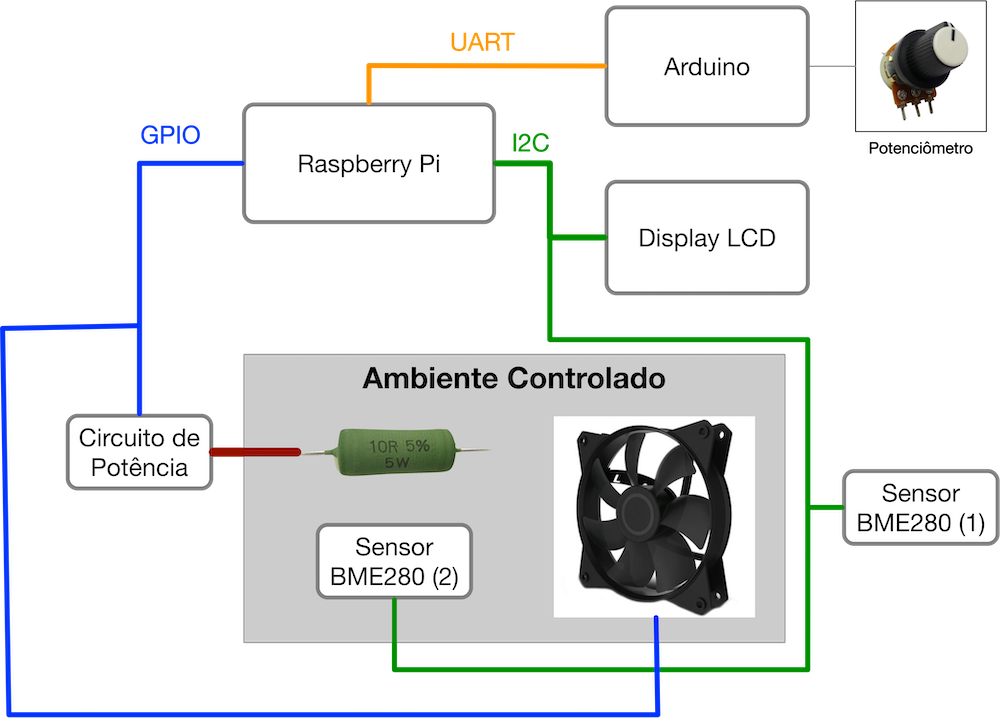

# Projeto 1

Projeto 1 da disciplina de Fundamentos de Sistemas Embarcados

## 1. Objetivos

Este trabalho tem por objetivo a realização do controle de temperatura de um sistema. O sistema possui internamente dois dispositivos para alterar sua temperatura. O primeiro é um resistor de potência de 15 Watts utilziado para aumentar temperatura e o segundo, uma ventoínha que puxa o ar externo (à temperatura ambiente) para reduzir a temperatura. 

A temperatura de referência (TR) pode ser definida pelo usuário do sistema de duas maneiras:
1. Através de um Potenciômetro;
2. Através de entrada de teclado no terminal.

O controle de temperatura do sistema deve ser realizado utilizando a abordagem de controle On/Off com histerese. A histerese é definida como a diferença entre o limite superior e o inferior da variável a ser controlada. Por exemplo, se a temperatura de operação do sistema for definida como 40˚C com histerese de 4˚C, os limites inferior e superior serão respectivamente de 38˚C e 42˚C.

Neste caso, quando o valor medido de temperatura ficar abaixo do limite inferior, o controlador deverá acionar o resistor de potência para aquecer o sistema. Caso a temperatura medida esteja acima do limite superior, o controlador deve desligar a resistência e acionar a ventoínha. 

## 2. Componentes do Sistema

O sistema como um todo é composto por:
1. Ambiente fechado controlado com o resistor de potência e ventoinha;
2. 01 Sensor BME280 (I2C) para a medição da temperatura interna (TI) do ambiente fechado;
3. 01 Sensor BME280 (I2C) para a medição da temperatura externa (TE);
4. 01 módulo Display LCD 16x2 com circuito I2C integrado (Controlador HD44780);
5. 01 Conversor lógico bidirecional (3.3V / 5V);
6. Circuito de potência com 2 relés;
6. 01 Arduino Micro;
7. Potenciômetro;
8. Raspberry Pi 4;

## 3. Conexões entre os módulos do sistema

1. Os sensores de temperatura BM280 estão ligados ao barramento I2C e utilizam os endereços (0x76 e 0x77);
2. O módulo de display LCD está conectado ao barramento I2C utilizando o endereço 0x27;
3. O resistor de potência e a ventoínha estão ambos ligados às portas GPIO e são acionados através do circuito de potência com relés;
4. O Arduino está conectado à placa Raspberry Pi via UART;
5. O potenciômetro é conectado à porta analógica do Arduino;

## 4. Requisitos

Os sistema de controle possui os seguintes requisitos:
1. O código deve ser desenvolvido em C/C++;
2. O sistema deve implementar o controle de temperatura On/Off do ambiente fechado;
3. O sistema deve apresentar uma interface de controle via terminal com menu de interação com o usuário e dados de temperaturas (TI, TE, TR) sendo atualizados a cada 500 ms;
4. O usuário deve ser capaz de escolher se quer definir a temperatura do  através de entrada de teclado ou pelo potenciômetro;
5. No caso da temperatura ser definida pelo potenciômetro, o programa deve consultar o valor do potenciômetro através da comunicação UART com o Arduino a cada 100 ms;
6. O sistema deve apresentar na tela LCD os valores das temperaturas (TI, TE, TR);
7. O programa deve gerar um log em arquivo CSV das seguintes informações a cada 02 segundos (Data e hora, temperatura interna, temperatura externa, temperatura definida pelo usuário).
8. O valor de histerese deve poder ser definido pelo usuário;
9. O código deve possuir Makefile para compilação;

## 5. Comunicação UART com Arduino

A leitura do valor do potenciômetro deve seguir o mesmo protocolo utilizado no [Exercício 1](referencias/Exercicio_1_UART.pdf). 
Neste caso, basta solicitar o valor de Float através do comando 0xA2. É obrigatório o envio do número de matrícula conforme especificado. 

## 6. Critérios de Avaliação

A avaliação será realizada seguindo os seguintes critérios:

|   ITEM    |   COMENTÁRIO  |   VALOR   |
|------------------------|---------------------------------------------------------------------------------------------------------|---------|
|**Implementação do controlador** | Correta implementação do controlador On/Off com histerese, incluindo a leitura das temperaturas e acionamento dos atuadores (resistor e ventoinha. |    3,0 |
|**Menu de controle**        | Correta implementação do menu com as opções de acesso do usuário e sua atualização de informações. | 1,0 |
|**Leitura do Potenciômetro**| Leitura do potenciômetro através da comunicação UART com o Arduino. | 1,5 |
|**Mostrador no LCD**        | Apresentação das 3 temperatudas no LCD. | 1,5 |
|**Armazenamento em arquivo**| Armazenamento em arquivo CSV dos dados medidos. |   1,0 |
|**Qualidade do Código**     | Utilização de boas práticas como o uso de bons nomes, modularização e organização em geral.    |  2,0 |
|**Pontuação Extra**         |   Qualidade e usabilidade acima da média.  |  0,5   |

## 7. Referências

[Driver da Bosh para o sensor BME280](https://github.com/BoschSensortec/BME280_driver)

