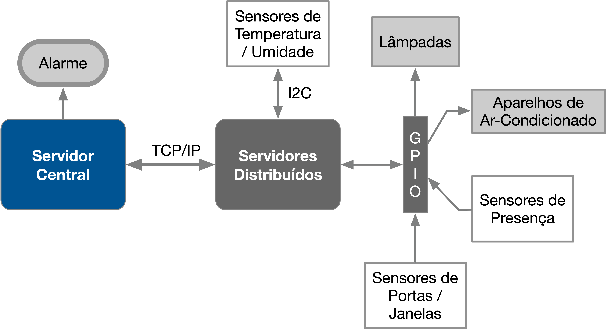
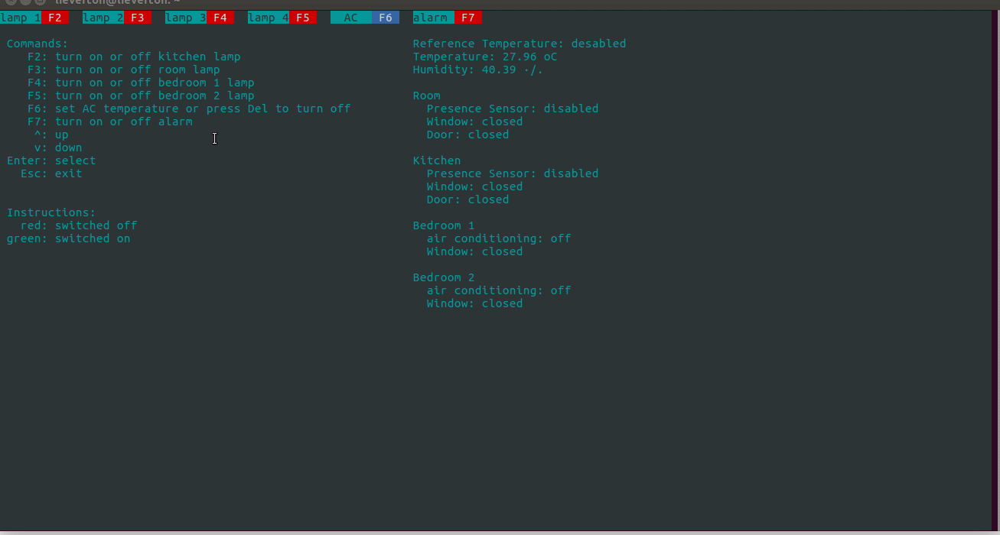

# Programa

## Proposta

## 1. Objetivos

Este trabalho tem por objetivo a criação de um sistema distribuído de automação residencial para controle e monitoramento de sensores e dispositivos. O sistema deve ser desenvolvido para funcionar em um conjunto de placas Raspberry Pi com um servidor central responsável pelo controle e interface com o usuário e servidores distribuídos para leitura e acionamento dos dispositivos. Dentre os dispositivos envolvidos estão o monitoramento de temperatura, sensores de presença, sensores de abertura e fechamento de portas e janelas, acionamento de lâmpadas, aparelhos de ar-condicionado e alarme.



Maiores informações e requisitos do trabalho disponíveis em:
*   [Gitlab - FSE - Projeto 2](https://gitlab.com/fse_fga/projetos/projeto-2).

## Demonstração



*Demonstração realizada as 15h10m em 05 de novembro de 2020.*

## Execução

1. O sitema é composto por dois servidores, primeiro vamos prosseguir com o servidor central. Na respberry para o servidor central clone o repositório:

    ```bash
    git clone https://github.com/lievertom/Fundamentos-de-Sistemas-Embarcados.git
    ```

2. Entre na pasta do servidor central:

    ```bash
    cd Fundamentos-de-Sistemas-Embarcados/projeto-2/programa/servidor_central/
    ```

3. Compile servidor central:

    ```bash
    make
    ```

4. Aumente a Tela:

    `F11`

5. Execute o programa:

    ```bash
    bin/bin
    ```

6. Agora na segunda raspberry repita o passo 1 e depois entre na pasta so servidor distribuido:

    ```bash
    cd Fundamentos-de-Sistemas-Embarcados/projeto-2/programa/servidor_distribuido/
    ```

7. Repita os passos 3 e 5 e volte para tela em execução do servidor central, ele estará pronto pra ser usado.

## Comandos

    F2 : interruptor da lamapada da cozinha
    F3 : interruptor da lamapada da sala
    F4 : interruptor da lamapada do quarto 1
    F5 : interruptor da lamapada do quarto 2
    F6 : selecionar a temperatura de referência
    F7 : interruptor do alrme
     ↑ : para cima
     ↓ : para baixo
     ↵ : selecionar
    Del: desativar temperatura de referência
    Esc: fechar
    
## Instruções

    vermelho : dispositivo desligado
       verde : dispositivo ligado

**Obs.:**

1. *para selecionar a temperatura de referência, primeiro aperte **F6** e depois navegue com as **setas** e depois selecione com **enter**;*

2. *para desligar o ar condicionado, primeiro aperte **F6** e depois **Del**;*

2. *O arquivo de log fica salvo em* `dat/data.csv`.

## Autor

|Matrícula | Estudante |
| -- | -- |
| 17/0039251 | Lieverton Santos Silva |

## Referências

*   [Driver da Bosh para o sensor BME280](https://github.com/BoschSensortec/BME280_driver)
*   [Biblioteca BCM2835 - GPIO](http://www.airspayce.com/mikem/bcm2835/)
*   [Descrição do trabalho prático 02](https://gitlab.com/fse_fga/projetos/projeto-2)
